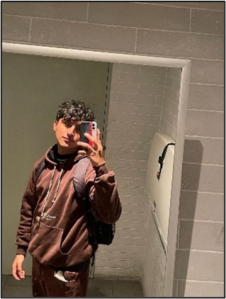

    <h3>Universidad Peruana de Ciencias Aplicadas</h3>
    </img> 
    <strong>Ingeniería de Software - 7mo Ciclo</strong> 
    <strong>Fundamentos de Arquitectura de Software</strong> 
    <strong>1ASI0657 - 3588</strong>      <strong>Profesor: Ernesto Ocampo Tello</strong> 
     <strong>Informe Final</strong>       <strong>AventuraPe</strong>  

<h3> Integrantes del Equipo: </h3>

| Integrante                          |    Código    |
| :---------------------------------- | :----------: |
| Paolo Gonzalo Párraga Gamarra       | u202219186   |
| Cama Salvatierra, Jimena Tamara     | u202210778   |
| Castillo Castillo, Jair Alexander   | u202211390   |
| Quezada Portalatino, Barbara Susana | u202211800   |

<h3 align="center">Abril, 2025</h3>

  

## Registro de Versiones del Informe

El objetivo de esta sección es resumir las modificaciones relevantes que se realizan al informe durante el ciclo de vida del proyecto. Esta sección inicia en una página nueva e incluye un cuadro con la siguiente estructura:

<table>
  <thead>
    <tr>
      <th>Versión</th>
      <th>Fecha</th>
      <th>Autor</th>
      <th>Descripción de modificación</th>
    </tr>
  </thead>
  <tbody>
    <tr>
      <td>1.0</td>
      <td>[Fecha Actual]</td>       <td>[Nombre(s) de Autor(es)]</td>
      <td>Creación inicial del documento y estructura base.</td>
    </tr>
    
  </tbody>
</table>

## Tabla de Contenidos

* [Registro de Versiones del Informe](#registro-de-versiones-del-informe)
* [Tabla de Contenidos](#tabla-de-contenidos)
* [Student Outcomes](#student-outcome)
* [Capítulo I: Introducción](#capítulo-i-introducción)
    * [1.1 Startup Profile](#11-startup-profile)
        * [1.1.1 Descripción de la Startup](#111-descripción-de-la-startup-aventurape)
        * [1.1.2 Perfiles de integrantes del equipo](#112-perfiles-de-integrantes-del-equipo-el-motor-de-aventurape-)
    * [1.2 Solution Profile](#12-solution-profile)
        * [1.2.1 Nombre del producto](#121-nombre-del-producto-aventurape)
        * [1.2.2 Antecedentes y problemática](#122-antecedentes-y-problemática-la-chispa-de-aventurape)
        * [1.2.3 Lean UX Process](#123-lean-ux-process)
            * [1.2.3.1 Lean UX Problem Statement](#1231-lean-ux-problem-statement)
            * [1.2.3.2 Lean UX Assumptions](#1232-lean-ux-assumptions)
            * [1.2.3.3 Lean UX Hypothesis](#1233-lean-ux-hypothesis)
            * [1.2.3.4 Lean UX Canvas](#1234-lean-ux-canvas)
    * [1.3 Segmentos objetivo](#13-segmentos-objetivo)

El curso **Fundamentos de Arquitectura de Software (SI657)** contribuye al cumplimiento del Student Outcome ABET:

**ABET – EAC - Student Outcome 7: Aprendizaje Continuo y Autónomo**
**Criterio:** La capacidad de adquirir y aplicar nuevos conocimientos según sea necesario, utilizando estrategias de aprendizaje apropiadas.

En el siguiente cuadro se describe las acciones realizadas y enunciados de conclusiones por parte del equipo, que permiten sustentar el haber alcanzado el logro del ABET – EAC - Student Outcome 7.

<table>
    <thead>
        <tr>
            <th><b>Criterio específico</b></th>
            <th><b>Acciones realizadas</b></th>
            <th><b>Conclusiones</b></th>
        </tr>
    </thead>
    <tbody>
        <tr>
            <td rowspan="1"><b>Actualiza conceptos y conocimientos necesarios para su desarrollo profesional y en especial para su proyecto en soluciones de software.</b></td>
            <td>
                <b>Paolo Gonzalo Párraga Gamarra</b> 
                TB1: [Acciones Pendientes] 
                 
                <b>Cama Salvatierra, Jimena Tamara</b> 
                TB1: [Acciones Pendientes] 
                 
                <b>Castillo Castillo, Jair Alexander</b> 
                TB1: [Acciones Pendientes] 
                 
                <b>Quezada Portalatino, Barbara Susana</b> 
                TB1: [Acciones Pendientes] 
                </td>
            <td rowspan="1">
                TB1: [Conclusiones Grupales Pendientes] 
                </td>
        </tr>
        <tr>
            <td rowspan="1"><b>Reconoce la necesidad del aprendizaje permanente para el desempeño profesional y el desarrollo de proyectos en soluciones de software.</b></td>
            <td>
                <b>Paolo Gonzalo Párraga Gamarra</b> 
                TB1: [Acciones Pendientes] 
                 
                <b>Cama Salvatierra, Jimena Tamara</b> 
                TB1: [Acciones Pendientes] 
                 
                <b>Castillo Castillo, Jair Alexander</b> 
                TB1: [Acciones Pendientes] 
                 
                <b>Quezada Portalatino, Barbara Susana</b> 
                TB1: [Acciones Pendientes] 
                </td>
            <td rowspan="1">
                 TB1: [Conclusiones Grupales Pendientes] 
                </td>
        </tr>
    </tbody>
</table>

# Capítulo I: Introducción

## 1.1 Startup Profile

### 1.1.1 Descripción de la Startup: AventuraPe

En el corazón de la rutina diaria, nace **AventuraPe**, una startup peruana con la misión de romper la monotonía e inyectar una dosis de emoción y descubrimiento en la vida de las personas. Somos una **plataforma web** innovadora, diseñada meticulosamente para ser el catalizador de experiencias locales únicas y espontáneas. Olvídate de la planificación exhaustiva y las grandes inversiones de tiempo; AventuraPe te conecta con micro aventuras personalizadas, adaptadas a tus gustos y disponibilidad, justo en tu entorno.

> *"Vivimos en un mundo acelerado donde explorar puede parecer un lujo. AventuraPe surge como la solución, un puente digital que une a usuarios curiosos con la riqueza oculta de su propia ciudad."*

Utilizando tecnología avanzada de geolocalización y un diseño intuitivo centrado en el usuario, abrimos un universo de actividades – desde rincones gastronómicos hasta talleres inesperados – fomentando la espontaneidad y la conexión genuina con la comunidad local.

Nuestra filosofía se basa en tres pilares fundamentales:
1.  **Optimización del Tiempo:** Aventuras accesibles que se ajustan a tu agenda.
2.  **Comodidad:** Descubre y decide sobre la marcha, sin complicaciones.
3.  **Conexión Local:** Impulsamos la visibilidad y el crecimiento de negocios locales, revelando sus propuestas únicas a un público ávido de novedad.

**Misión:**
> Empoderar a cada persona para que redescubra su entorno a través de micro aventuras significativas, fomentando la exploración, la diversión espontánea y un lazo más fuerte con su comunidad local. Queremos ser el chispazo que enciende la alegría en lo cotidiano.

**Visión:**
> Convertirnos en la **plataforma web** líder y referente a nivel nacional para el descubrimiento de experiencias locales auténticas, transformando la interacción de las personas con su entorno y contribuyendo activamente al desarrollo de comunidades vibrantes, conectadas y sostenibles.

### ### 1.1.2. Perfiles de integrantes del equipo  

<table>
  <tr align="center">
    <td rowspan="4">
      
    </td>
    <td align="left">
      <b>Nombre y Apellido:</b>
                   
      Paolo Gonzalo Párraga Gamarra
    </td>
  </tr>
  <tr>
    <td align="left">
    <b>Código:</b>
     
    U202219186
    </td>
  </tr>
  <tr>
    <td align="left">
    <b>Carrera:</b>
     
    Ingeniería de Software
    </td>
  </tr>
  <tr>
    <td align="left">
    <b>Acerca de:</b>
     
    Soy .
    </td>
  </tr>
  </tr>

  <tr align="center">
    <td rowspan="4">
      
    </td>
    <td align="left">
      <b>Nombre y Apellido:</b>
                   
      Barbara Susana Quezada Portalatino
    </td>
  </tr>
  <tr>
    <td align="left">
    <b>Código:</b>
     
    U202211800
    </td>
  </tr>
  <tr>
    <td align="left">
    <b>Carrera:</b>
     
    Ingeniería de Software
    </td>
  </tr>
  <tr>
    <td align="left">
    <b>Acerca de:</b>
     
    Barbara Susana Quezada Portalatino, cursando el séptimo ciclo de la carrera de software, trabajo mayormente bajo un rol de líder que me ayuda a poder organizar no solo la ideas de mi grupo sino que las ideas aterricen en la ejecución. Soy una persona muy disciplinada y detallista.
    </td>
  </tr>
  </tr>
   <tr align="center">
    <td rowspan="4">
      
    </td>
    <td align="left">
      <b>Nombre y Apellido:</b>
                   
      Jimena Tamara Cama Salvatierra
    </td>
  </tr>
  <tr>
    <td align="left">
    <b>Código:</b>
     
    U2022210778
    </td>
  </tr>
  <tr>
    <td align="left">
    <b>Carrera:</b>
     
    Ingeniería de Software
    </td>
  </tr>
  <tr>
    <td align="left">
    <b>Acerca de:</b>
     
     Soy estudiante de la carrera de Ingeniería de Software en la UPC y actualmente estoy cursando el 7mo ciclo. Me considero una persona curiosa, determinada y organizada. Con la experiencia en proyectos de startup y trabajos en equipo, trabajaré junto a mis compañeros para lograr un óptimo resultado del proyecto.
    </td>
  </tr>
  </tr>

<tr align="center">
    <td rowspan="4">
      
    </td>
    <td align="left">
      <b>Nombre y Apellido:</b>
                   
      Jair Alexander Castillo Castillo
    </td>
  </tr>
  <tr>
    <td align="left">
    <b>Código:</b>
     
    U202211390
    </td>
  </tr>
  <tr>
    <td align="left">
    <b>Carrera:</b>
     
    Ingeniería de Software
    </td>
  </tr>
  <tr>
    <td align="left">
    <b>Acerca de:</b>
     
    Soy estudiante de la carrera de Ingeniería de Software en la UPC y me encuentro en el 7to ciclo. Me considero una persona dedicada, comprensiva y metódica. Con mis habilidades de liderazgo y mi capacidad para trabajar en equipo en un ambiente de respeto, estoy segura de que podré dirigir la implementación de la startup de nuestro proyecto de manera exitosa.
    </td>
  </tr>
  </tr>
<table>
  

## 1.2 Solution Profile

### 1.2.1 Nombre del producto: AventuraPe

El corazón de nuestra propuesta tecnológica lleva por nombre **AventuraPe**. Este nombre encapsula la esencia de nuestra solución: una invitación a la **Aventura** local, con un claro arraigo **Pe**ruano. Es la marca bajo la cual los usuarios descubrirán y vivirán experiencias únicas a través de nuestra **plataforma web**. (El término "ExploraYa", mencionado en el markdown original como nombre del reporte, identifica este documento y el esfuerzo académico del equipo detrás del proyecto).

### 1.2.2 Antecedentes y problemática: La Chispa de AventuraPe

**Contexto Actual (Antecedentes):**
En el ritmo vertiginoso de la vida moderna, emerge una creciente sed de experiencias auténticas y momentos de escape que no demanden la carga de una planificación compleja o grandes desembolsos. Si bien las herramientas digitales han abierto puertas a la exploración local, muchas se enfocan en eventos tradicionales o requieren una organización previa que choca con el deseo de espontaneidad.

**El Desafío (Problemática):**
Identificamos una brecha significativa en el mercado: la falta de una solución ágil y personalizada para quienes buscan **micro aventuras espontáneas**. Las plataformas existentes a menudo caen en recomendaciones genéricas, volviendo predecible lo que debería ser emocionante. Simultáneamente, **negocios locales** con ofertas únicas luchan por conectar eficazmente con este público dinámico y espontáneo, perdiendo oportunidades valiosas en un mercado competitivo. El resultado es doble: usuarios desconectados de las joyas ocultas de su entorno y negocios locales subestimados.

**Nuestra Propuesta de Valor:**
AventuraPe nace para resolver este doble desafío, actuando como un ecosistema digital inteligente que:
* **Para Usuarios (Aventureros):** Facilita el descubrimiento de actividades cercanas, personalizadas y sorprendentes, adaptadas a su tiempo e intereses, fomentando la exploración activa y el disfrute del momento a través de una página web.
* **Para Negocios (Emprendedores):** Ofrece una vitrina directa y efectiva para promocionar sus servicios, atraer nuevos clientes y destacar sus propuestas únicas ante un público que valora la autenticidad y la novedad.

**Objetivos Clave y Alcance del Proyecto:**
Nuestros objetivos principales, definidos bajo la metodología SMART, son claros y medibles:
1.  **Incrementar la tasa de participación** de usuarios en micro aventuras espontáneas reservadas a través de la plataforma web al **30%** dentro del primer mes del lanzamiento, utilizando específicamente la función "Sorpréndeme" como métrica clave.
2.  **Atraer al menos 80 empresas locales** para que publiquen activamente actividades en la plataforma durante los primeros tres meses post-lanzamiento, impulsado por campañas de marketing dirigidas y alianzas estratégicas.

El alcance de este proyecto comprende el diseño, desarrollo e implementación de la **plataforma web AventuraPe**, incluyendo las funcionalidades esenciales para los perfiles de Aventurero y Emprendedor detalladas en el Product Backlog, y su correspondiente **backend** desplegado en una arquitectura cloud (Azure/Render).

**Marco de Operación (Restricciones):**
El desarrollo de AventuraPe se enmarca dentro de las siguientes limitaciones y definiciones tecnológicas fundamentales:
* **Plazo:** Conclusión y entrega funcional dentro de los límites del ciclo académico correspondiente (2025-01).
* **Tecnologías Definidas:** El **backend** se desarrolla utilizando **Spring Boot** con herramientas de construcción como **Maven/Gradle**. La gestión del código fuente y la colaboración se realiza mediante **Git** y **GitHub**, aplicando el flujo de trabajo **GitFlow**. El **frontend web** se desarrollará utilizando Tecnologías Web,  React, Angular, Vue, HTML/CSS. La documentación de APIs se realiza con **Swagger/OpenAPI**. El diseño UI/UX se apoya en **Figma**. La base de datos utilizada es **PostgreSQL** gestionada vía PgAdmin. El despliegue se realiza en plataformas cloud como **Azure** o **Render**.
* **Equipo:** Capacidades y disponibilidad del equipo estudiantil conformado.
* **Funcionalidad:** Limitado a las User Stories priorizadas y contenidas en el Product Backlog acordado para este ciclo.

**Análisis Profundo (5 W’s y 2 H’s):**

**Who? - ¿Quién?**  

Individuos y grupos urbanos (principalmente jóvenes adultos, 18-35 años) en busca de romper la rutina; y negocios locales (cafés, talleres, centros de ocio, etc.) deseosos de mayor visibilidad y clientela.

**What? - ¿Qué?**  

Una **plataforma web** inteligente que actúa como curadora de micro aventuras personalizadas y espontáneas, conectando oferta y demanda local.

**Where? - ¿Dónde?** 

Principalmente en entornos urbanos y semiurbanos de Perú con una oferta diversa de actividades y una población conectada digitalmente.

**When? - ¿Cuando?**  

En cualquier momento de ocio inesperado: tardes libres, fines de semana, pausas en el trabajo, o durante visitas a nuevas zonas de la ciudad.

**Why? - ¿Por qué?** 

Para combatir la monotonía, facilitar el descubrimiento local, promover la espontaneidad y dinamizar la economía de pequeños negocios.

**How? - ¿Cómo?**  

A través de algoritmos que consideran ubicación, preferencias del usuario (implícitas y explícitas), tiempo disponible y popularidad, presentados en una **interfaz web** intuitiva y atractiva, respaldada por un backend robusto.

**How much? - ¿Cuánto?**  

Requiere una inversión inicial para el desarrollo tecnológico (**web** y backend), seguida de estrategias de marketing digital y un modelo de negocio sostenible basado en **comisión** por transacción o reserva facilitada a través de la plataforma.

### 1.2.3 Lean UX Process

#### 1.2.3.1 Lean UX Problem Statement
[Contenido Pendiente - Desarrollar los Problem Statements para AventuraPe basados en el análisis]

#### 1.2.3.2 Lean UX Assumptions
[Contenido Pendiente - Desarrollar las Assumptions para AventuraPe]

#### 1.2.3.3 Lean UX Hypothesis
[Contenido Pendiente - Desarrollar las Hypothesis para AventuraPe]

#### 1.2.3.4 Lean UX Canvas
[Contenido Pendiente - Incluir aquí el Lean UX Canvas elaborado para AventuraPe, preferiblemente como imagen]
## 1.3 Segmentos objetivo
[Contenido Pendiente - Definir y describir detalladamente los segmentos objetivo para AventuraPe, basados en la investigación inicial y el análisis]

---

